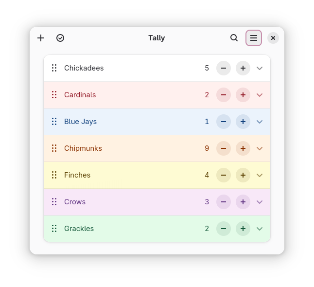

# Tally

_Count anything._

This application is a tally counter for the GNOME desktop on Linux.

## Installing

[](https://flathub.org/apps/ca.vlacroix.Tally)

## Building

Build with [Flatpak Builder](https://docs.flatpak.org/en/latest/flatpak-builder.html).

```sh
flatpak-builder .build ca.vlacroix.Tally.json --user --install --force-clean
flatpak run ca.vlacroix.Tally
```

To build and run the development version, add `.Devel` after the application's name.

```sh
flatpak-builder .build ca.vlacroix.Tally.Devel.json --user --install --force-clean
flatpak run ca.vlacroix.Tally.Devel
```

## Localization

Tally uses [gettext](https://www.gnu.org/software/gettext) for localization. These instructions assume you have it installed on your system.

To begin, create a message file using `msginit`. Execute this command in a terminal from Tally's root folder:

```sh
make po/<LANG>.po
```

Both instances of <LANG> should be replaced by the two-letter language code for the language you're translating the app to, optionally followed by an underscore `_` character and a two-letter country code in ALL-CAPS i.e. `fr` for French or `fr_CA` for Canadian French.

Next, edit the `<LANG>.po` file you made in the `po/` folder. I recommend using [Translation Editor](https://flathub.org/apps/org.gnome.Gtranslator) for this.

Once finished, commit the finished `<LANG>.po` file to git, push to your branch, and open a pull request.

### Updating a Localization

If the application is updated and the translation needs to be changed, again run this command in the project's root folder:

```sh
make po/<LANG>.po
```

This will update the given `.po` file with the new translatable strings. The updated `.po` file for your language may then be modified, committed, and put into a pull request as usual.
