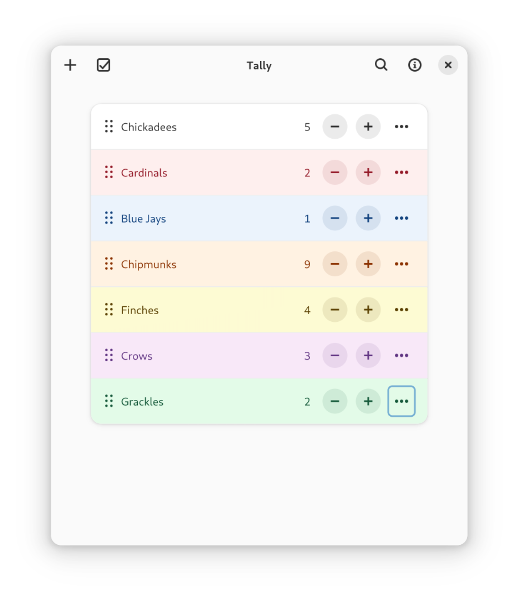

# Tally

A counter for GNOME.

## Building

Build with [Flatpak Builder](https://docs.flatpak.org/en/latest/flatpak-builder.html).

```sh
flatpak-builder .build ca.vlacroix.Tally.json --user --install --force-clean
flatpak run ca.vlacroix.Tally
```

To build and run the development version, add `.Devel` after the application's name.

```sh
flatpak-builder .build ca.vlacroix.Tally.Devel.json --user --install --force-clean
flatpak run ca.vlacroix.Tally.Devel
```
